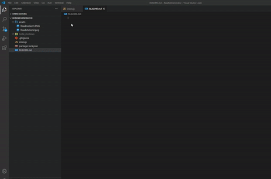

# README Generator 
### Repository Link: https://github.com/greysonkirk/ReadMeGenerator 
### Application Link: https://greysonkirk.github.io/ReadMeGenerator/

This application is used to generate a quality README. With the formatting already coded in, the user can fill out prompted questions and have an already formatted README.
After cloning the repository, the user types "node index.js" in the terminal and fills out the questions

